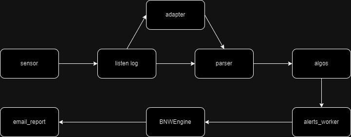

- [A Developer's Guide to Setup Log Forwarding](#a-developers-guide-to-setup-log-forwarding)
  - [Log Process Flow](#log-process-flow)
  - [External Forwarder](#external-forwarder)
    - [Global Variables and Constants](#global-variables-and-constants)
    - [MatchedAgent Class](#matchedagent-class)
    - [Forwarder Core Functions](#forwarder-core-functions)
    - [Redis Metrics](#redis-metrics)
    - [UEBA Alerts Forwarding](#ueba-alerts-forwarding)
  - [External Forwarder Database Configuration](#external-forwarder-database-configuration)
    - [Variables and Constants](#variables-and-constants)
    - [Usage Modes](#usage-modes)
      - [Interactive Mode](#interactive-mode)
      - [Batch Mode](#batch-mode)
    - [JSON Configuration Format](#json-configuration-format)
      - [Per-log-type examples](#per-log-type-examples)
    - [Interactive User Input](#interactive-user-input)
    - [Configuration Tool Core Functions](#configuration-tool-core-functions)
  - [Extending the Forwarder to Support Additional Log Types](#extending-the-forwarder-to-support-additional-log-types)
    - [Configuring Routing Keys and Pika Exchange](#configuring-routing-keys-and-pika-exchange)
    - [Log Parsing Workflow](#log-parsing-workflow)
    - [Adding a Custom Parser](#adding-a-custom-parser)
  - [Appendix](#appendix)
    - [Legacy External Forwarder Database Configuration (Command-Line Version)](#legacy-external-forwarder-database-configuration-command-line-version)
      - [Command-Line Arguments](#command-line-arguments)
      - [Example Usage](#example-usage)
      - [Legacy Core Functions](#legacy-core-functions)

# A Developer's Guide to Setup Log Forwarding

## Log Process Flow



In general, all logs originating from sensors follow the process illustrated in Figure above. To forward a log to specific target(s), the log can be captured after it has been processed by `listen_log.py`. The `listen_log.py` script sends the processed logs to RabbitMQ exchanges like `received_log` and `standard_raw_log`. You can direct logs from any exchange to the forwarder's queue.
Additionally, UEBA alerts published by `alerts_worker.rb` are sent to the `notify` exchange and consumed by the forwarder as described below.

## External Forwarder

The `external_forwarder.py` script implements the forwarding mechanism described in Section above. It can forward messages to any target as long as the target is configured in MongoDB. At the time of writing this guide, it parses Windows, Auditd, SSH, CyberArk, PostgreSQL, MySQL, DB2, OracleDB logs, UEBA alerts, netdev logs, and DNS payload events, forwarding them to configured targets.
It also forwards UEBA alert events published to RabbitMQ exchange (see [UEBA Alerts Forwarding](#ueba-alerts-forwarding)).

The forwarder reads its configuration from MongoDB, expecting a list of configuration objects in the format created by `external_forwarder_dbconfig.py`. Each configuration object contains agent IDs, pika routing key-exchange mappings, and target information, allowing for flexible and granular control over log forwarding rules.

### Global Variables and Constants

- `ENV_HELPER`
  An instance of `env_helper.EnvHelper()` used to build loggers and create MongoDB/RabbitMQ clients.

- `PIKA_EXCHANGE_IN_1`, `PIKA_EXCHANGE_IN_2`, `PIKA_EXCHANGE_IN_3`, `PIKA_EXCHANGE_IN_4`
  Names of RabbitMQ topic exchanges the forwarder consumes from:
  - `PIKA_EXCHANGE_IN_1 = "received_log"` (sensor/log pipeline)
  - `PIKA_EXCHANGE_IN_2 = "standard_raw_log"` (raw DB/app logs)
  - `PIKA_EXCHANGE_IN_3 = "notify"` (UEBA alerts)
  - `PIKA_EXCHANGE_IN_4 = "dnspayload_msgpacked"` (DNS msgpack payloads)

- `PIKA_QUEUE_IN`
  The internal queue name used by the forwarder: `"external_forwarder"`. The queue is created with TTL and max-length, then bound to exchanges based on configured routing keys.

_Routing key sets (used to classify system type from the delivery routing key):_

- `WINDOWS_ROUTING_KEY = ['sys_events', 'win_events', 'app_events.db_mssql.mssql.db', 'powershell_events']`
- `AUDITD_ROUTING_KEY = ['auditd']`
- `SSH_ROUTING_KEY = ['ssh']`
- `CYBERARK_ROUTING_KEY = ['cyberark']`
- `POSTGRES_ROUTING_KEY = ['postgresql']`
- `MYSQL_ROUTING_KEY = ['mysql']`
- `DB2_ROUTING_KEY = ['db2']`
- `ORACLE_ROUTING_KEY = ['oracle']`
- `ALERT_ROUTING_KEY = ['alerts_worker']`
- `NETDEV_ROUTING_KEY = ['netdev']`
- `DNS_ROUTING_KEY = ['']` (empty string for DNS payload binding)

- `PIKA_FILTER`
  Default exchange mapping used when a configuration object provides an empty `"pika"` map:
  - Keys from WINDOWS_ROUTING_KEY + AUDITD_ROUTING_KEY + SSH_ROUTING_KEY map to `received_log`
  - Keys from CYBERARK/POSTGRESQL/MYSQL/DB2/ORACLE/NETDEV map to `standard_raw_log`
  - Keys from ALERT_ROUTING_KEY map to `notify`
  - Keys from DNS_ROUTING_KEY (empty string) map to `dnspayload_msgpacked`

- `SEPARATOR`
  Dictionary that defines line/message separators for each system before parsing:
  - `{'windows': '\r\n', 'auditd': '\n', 'ssh': '\n', 'cyberark': None, 'postgresql': None, 'mysql': None, 'db2': None, 'oracle': None, 'alert': None, 'netdev': None, 'dns': None}`

- `db` and `config`
  - `db`: MongoDB database handle (`contextguard`)
  - `config`: List of configuration objects loaded from `customer_pref._key = "external_forwarder"`, normalized with resolved `agent_ids` and used to build bindings and targets.

- `targets_dict`
  Map keyed by `"<includes>|@|<excludes>|@|<pika_map>"` to an array of initialized syslog logger targets (instances created by `initialize_syslog_target()` wrapping `SfTcpSyslogHandler`).

- `grok_patterns`
  Dict of compiled Grok patterns per system (`windows`, `linux`, `cyberark`, `postgresql`, `postgresql_generic`, `mysql`, `db2`, `db2_generic`, `oracle`, `oracle_evtlog`, `alert`, `netdev`) used by `parse_grok()`.

- `logger`
  Module-level logger created via `ENV_HELPER.build_logger('external_forwarder', loglevel='info')`.

- Windows event formatting constants (per SCDF instructions; do not change unless instructed):
  - `EVENT_LOG_TYPE = 'MSWinEventLog'`
  - `SID_TYPE = 'N/A'`
  - Event ID sets controlling severity and channel mapping:
    - `SECURITYID` (Security channel IDs)
    - `SYSTEMID` (System channel IDs)
    - `CRITICAL`, `PRIORITY`, `WARNING`, `INFORMATION`, `CLEAR` (severity buckets)

### MatchedAgent Class

`MatchedAgent` is a helper class that encapsulates the set of agent identifiers matched against a RabbitMQ routing key, and exposes the inclusion/exclusion filtering logic used by `onMessage()`.

- **`can_forward_data`** _(property)_
  Returns `True` if at least one agent is present in the matched set; `False` for an empty set.

- **`find_values(*values)`** _(classmethod)_
  Resolves a list of raw values into agent identifiers.
  - Integer values are looked up in the `agent_ids` MongoDB collection and replaced with their `scalable_role`.
  - String values are split on `'.'` and only the first component is kept (e.g. `"sensor.db"` → `"sensor"`).
  - Returns a `MatchedAgent` instance containing the resolved identifiers.

- **`find_matching(sender_key, *values)`** _(classmethod)_
  Filters `values` down to those that appear in the routing key (`sender_key`) and returns a `MatchedAgent` of the matches.
  - If `''` (empty string) is among the values, the method falls back to extracting the identifier from the routing key itself: uses the first component if it is a digit (resolved via `find_values`), otherwise uses the second component.

- **`match_from_includes_excludes(sender_key, includes, excludes)`** _(classmethod)_
  Computes the effective set of matched agents by applying inclusion and exclusion lists:
  1. Calls `find_matching(sender_key, *includes)` to obtain the inclusion set.
  2. Calls `find_matching(sender_key, *excludes)` to obtain the exclusion set.
  3. Returns a `MatchedAgent` built from the set difference _(inclusions − exclusions)_.
     This is the primary method called by `onMessage()`.

### Forwarder Core Functions

- `onInit()`
  This initialization function sets up various components, including the logger, MongoDB connection, RabbitMQ (pika), the list of targets, and Grok patterns.

- `onExit()`
  The termination function shuts down RabbitMQ (pika) and the logger before exiting the script.
- `onMessage()`
  This callback function is triggered when messages are consumed from RabbitMQ via pika. It initializes the `external_forwarder` queue at the start, unpacks the received message, and then passes it to the `send()` function for processing. The queue is bound using the topic pattern `#.routing_key.#` for each configured routing key. For each configuration item the function reads the `includes` and `excludes` lists and calls `MatchedAgent.match_from_includes_excludes()` to compute the effective agent set; messages are forwarded only if the resulting set is non-empty and the exchange matches the configuration.
- `send()`
  This function processes the received message. It forwards the message based on the system type of the log. The log will be parsed by the system-specific parser if it matches the expected format. If parsing is unsuccessful, the message will be forwarded directly to the target without further processing.
  - For `alert` (routing key `#.alerts_worker.#` from `notify`), the forwarder formats alert events as RFC 5424-like syslog lines using fields such as `_timestamp`, `dst_role`, `threat_name`, and entity arrays (`risk_entity`, `attack_entity`, `affected_entity`). The human-readable body is extracted from the message by trying the fields `pure_html`, `body`, and `html` in order, then falling back to the raw message object; the resulting HTML is stripped of tags via BeautifulSoup before embedding.

- `retrieve_config_from_db(config_item, field)`
  Helper function called by `initialize_config()` for both `includes` and `excludes` fields. For each value in the named field of a configuration item it attempts to resolve the value to an agent ID:
  - If the value is an integer (or can be cast to one) it is kept as-is.
  - If it is a string it is looked up in the `agent_ids` collection by `scalable_role`; all matching numeric `_key` values are collected. If no match is found the original string is kept.
    The resolved list (deduplicated) is written back into `config_item[field]`.

### Redis Metrics

The forwarder records delivery metrics to Redis via the `record_metrics()` function (initialized by `RedisConn(buffer_capacity=10000, metric_type="external_forwarder")` and `Limiter(redis, "log", "log")`).

Metrics are recorded on each successful outbound send in `send_msg()`, using a Limiter-compatible Redis hash format.

**Redis key format:**

```
external_forwarder:<matched_agents>-<system>-<target>
```

Where `<matched_agents>` is the matched agent(s), `<system>` is the detected log type (e.g. `windows`, `auditd`, `alert`, `dns`) and `<target>` is the syslog target logger name (format: `<ip>-<port>-<socket_type>`).

**Hash fields per key:**

| Field                | Description                                                           |
| -------------------- | --------------------------------------------------------------------- |
| `<timestamp>:bytes`  | Cumulative bytes sent (incremented by the UTF-8 encoded message size) |
| `<timestamp>:events` | Cumulative event count (incremented by 1 per message)                 |

Where `<timestamp>` is the current Unix epoch in seconds (integer).

**TTL:** Each key expires after **3600 seconds** (1 hour) via `redis.connection.expire()`.

**Example:**

For a Windows log forwarded to target `192.168.1.10-514-TCP` at epoch `1700000000`:

- Key: `external_forwarder:windows-192.168.1.10-514-TCP`
- Fields: `1700000000:bytes` = 1024, `1700000000:events` = 3

> Note: Metrics are only recorded for successful deliveries. Failed sends (exceptions in `send_msg()`) are logged as warnings but do not produce metric entries.

### UEBA Alerts Forwarding

This integration lets UEBA alerts flow from the alerting pipeline to external syslog targets.

- Producer:
  - The Ruby worker `alerts_worker.rb` publishes alerts to the RabbitMQ topic exchange `notify` with routing key `alerts_worker.#{server_role}.#{alert_type}`:
    - `@notify_alerts_exchange = mq_ch.topic("notify")`
    - `@notify_alerts_exchange.publish(msg.to_msgpack, routing_key: 'alerts_worker.#{server_role}.#{alert_type}')`
  - The Ruby worker `email_report.rb` also contributes alert body content. It now publishes a `pure_html` field alongside the existing `html` field in its outbound message, providing a clean HTML body that is free of Ruby template artefacts:
    ```ruby
    out = {
      subject:   subject,
      type:      report_type,
      html:      final_html,
      pure_html: email_data[:body]   # raw body without Ruby template code
    }
    ```
- Consumer:
  - The Python forwarder subscribes to `notify` for `#.alerts_worker.#`, detects the `alert` system, and formats each alert into a syslog message compliant with RFC 5424 style:
    - Priority: 113
    - Timestamp from `_timestamp`
    - Hostname from `dst_role`
    - App name: `UEBA`
    - Message ID from `threat_name`
    - Structured data: `-`
  - The human-readable body is extracted by `form_body_alert()` using the following priority order: `pure_html` → `body` → `html` → raw message object. The selected value is then passed through BeautifulSoup to strip HTML tags before being embedded in the syslog line. Preferring `pure_html` avoids Ruby template code that can appear in the `html` field.
- Alert message schema expectations:
  - Encoding: MessagePack (Ruby publishes via `msg.to_msgpack`)
  - Required fields used by the forwarder: `_timestamp` (epoch seconds), `dst_role` (string), `threat_name` (string), `risk_entity` (array of objects), `attack_entity` (array of objects), `affected_entity` (array of objects)
  - Optional body fields (checked in priority order by `form_body_alert()`): `pure_html` (string, preferred — raw HTML body without template artefacts), `body` (string), `html` (string)
- Configuration:
  - To enable this path, add the routing key mapping in the DB configuration: `"syslog": "notify"` (see [Json Configuration Format](#json-configuration-format)). Targets configured for the same configuration object will receive the formatted syslog alerts over UDP/TCP as specified.

## External Forwarder Database Configuration

The `external_forwarder_dbconfig.py` script manages the database configuration for the forwarder and supports both interactive and batch processing modes. Upon initialization, it establishes a connection to MongoDB. The script can operate in two modes:

1. **Interactive Mode**: Prompts users for configuration details step by step
2. **Batch Mode**: Processes JSON configuration files using the `-c <filename.json>` argument

### Variables and Constants

- `customer_pref`
  A MongoDB client that connects to the customer pref collection in the database.
- `DB_KEY`
  It is defined as `external_forwarder`.
- `CONFIG`
  Used as the key for storing configuration data within the MongoDB document.

### Usage Modes

#### Interactive Mode

Run the script without arguments to enter interactive mode:

```bash
python3 external_forwarder_dbconfig.py
```

#### Batch Mode

Process a JSON configuration file for bulk operations:

```bash
python3 external_forwarder_dbconfig.py -c config.json
```

The JSON configuration file should contain an array of configuration objects. Each object must have an `action` field and appropriate configuration data based on the action type.

### JSON Configuration Format

The JSON configuration file should follow this structure:

```json
[
  {
    "action": "add",
    "includes": [123, "web-server-01", "db-server-02"],
    "excludes": [],
    "pika": {
      "win_events": "received_log",
      "linux": "received_log",
      "syslog": "notify"
    },
    "targets": [
      { "ip": "192.168.1.1", "port": 678, "socket_type": "UDP" },
      { "ip": "192.168.1.2", "port": 514, "socket_type": "TCP" }
    ]
  },
  { "action": "check" },
  {
    "action": "delete",
    "includes": [123, "web-server-01"],
    "excludes": [],
    "pika": {
      "win_events": "received_log",
      "linux": "received_log",
      "syslog": "notify"
    },
    "targets": [
      { "ip": "192.168.1.1", "port": 678, "socket_type": "UDP" },
      { "ip": "192.168.1.2", "port": 514, "socket_type": "TCP" }
    ]
  }
]
```

#### Per-log-type examples

- Windows Event Logs (received_log)

```json
[
  {
    "action": "add",
    "includes": ["all-windows-agents"],
    "excludes": [],
    "pika": {
      "win_events": "received_log",
      "sys_events": "received_log",
      "app_events.db_mssql.mssql.db": "received_log"
    },
    "targets": [{ "ip": "10.0.0.10", "port": 514, "socket_type": "UDP" }]
  }
]
```

- Linux audit/syslog (received_log)

```json
[
  {
    "action": "add",
    "includes": ["linux-fleet"],
    "excludes": [],
    "pika": {
      "linux": "received_log",
      "ssh": "received_log"
    },
    "targets": [{ "ip": "10.0.0.11", "port": 514, "socket_type": "UDP" }]
  }
]
```

- CyberArk (standard_raw_log)

```json
[
  {
    "action": "add",
    "includes": ["cyberark-connector"],
    "excludes": [],
    "pika": {
      "cyberark": "standard_raw_log"
    },
    "targets": [{ "ip": "10.0.0.12", "port": 514, "socket_type": "TCP" }]
  }
]
```

- PostgreSQL (standard_raw_log)

```json
[
  {
    "action": "add",
    "includes": ["db-servers"],
    "excludes": [],
    "pika": {
      "postgresql": "standard_raw_log"
    },
    "targets": [{ "ip": "10.0.0.13", "port": 514, "socket_type": "UDP" }]
  }
]
```

- MySQL (standard_raw_log)

```json
[
  {
    "action": "add",
    "includes": ["db-servers"],
    "excludes": [],
    "pika": {
      "mysql": "standard_raw_log"
    },
    "targets": [{ "ip": "10.0.0.14", "port": 514, "socket_type": "UDP" }]
  }
]
```

- IBM DB2 (standard_raw_log)

```json
[
  {
    "action": "add",
    "includes": ["db-servers"],
    "excludes": [],
    "pika": {
      "db2": "standard_raw_log"
    },
    "targets": [{ "ip": "10.0.0.15", "port": 514, "socket_type": "UDP" }]
  }
]
```

- Oracle (standard_raw_log)

```json
[
  {
    "action": "add",
    "includes": ["oracle-servers"],
    "excludes": [],
    "pika": {
      "oracle": "standard_raw_log"
    },
    "targets": [{ "ip": "10.0.0.16", "port": 514, "socket_type": "UDP" }]
  }
]
```

- UEBA Alerts (notify)

Note: Alerts are published with routing keys like `alerts_worker.<sensor_role>.<alert_type>`. Since agent IDs are not included in these routing keys, set `"includes": [""]` to apply to all. To restrict to specific alert types from certain sensors, list them in `"includes"` as `"<sensor_role>.<alert_type>"` entries. Use `"excludes"` to omit specific sensor/alert-type combinations. For example, to forward only db alerts from sensor `test_sensor`:

```json
[
  {
    "action": "add",
    "includes": ["test_sensor.db"],
    "excludes": [],
    "pika": {
      "alerts_worker": "notify"
    },
    "targets": [{ "ip": "10.0.0.20", "port": 514, "socket_type": "TCP" }]
  }
]
```

- Netdev (standard_raw_log)

```json
[
  {
    "action": "add",
    "includes": [""],
    "excludes": [],
    "pika": {
      "netdev": "standard_raw_log"
    },
    "targets": [{ "ip": "10.0.0.16", "port": 514, "socket_type": "UDP" }]
  }
]
```

- DNS (dnspayload_msgpacked)

```json
[
  {
    "action": "add",
    "includes": [""],
    "excludes": [],
    "pika": {
      "": "dnspayload_msgpacked"
    },
    "targets": [{ "ip": "10.0.0.16", "port": 514, "socket_type": "UDP" }]
  }
]
```

### Interactive User Input

The script uses the `get_user_inputs()` function to interactively collect configuration details from the user, providing a user-friendly experience with step-by-step prompting. The interactive mode now supports multiple configurations in a single session:

1. **Action Selection**: The user selects an action: add, delete, or check
2. **Inclusion Configuration**: For add actions, users specify which agents/sensors/alert-types to include — by numeric agent ID, agent name, or alert-type string — or leave empty to match all
3. **Exclusion Configuration**: Users then specify which agents/sensors/alert-types to exclude, enabling fine-grained filtering on top of the inclusion list
4. **Routing Key-Exchange Pairs**: Users can configure multiple routing key and exchange pairs for RabbitMQ message routing
5. **Target Configuration**: Users can specify multiple target systems with their IP addresses, ports, and socket types

**Enhanced Interactive Features:**

- **Inclusion and Exclusion Support**: Separate prompts collect `includes` and `excludes` lists, replacing the former single `agents` list
- **Multiple Routing Keys**: Support for configuring multiple routing key-exchange pairs
- **Multiple Targets**: Ability to forward logs to multiple destination systems
- **Input Validation**: The script validates IP addresses, ports, and socket types
- **User-Friendly Prompts**: Clear instructions and the ability to stop adding entries at any point

For example, to configure specific agents to forward Windows and Linux logs to multiple targets:

```console
$ python3 external_forwarder_dbconfig.py

External Log Forwarding Configuration Tool
======================================

Select action (add/delete/check): add
Enter inclusion, can be agent id or agent name or alert type (press Enter for all):
123
Do you want to add/delete more entries? Press Enter or type 'no' to stop.
web-server-01
Do you want to add/delete more entries? Press Enter or type 'no' to stop.
no
Enter exclusion, can be agent id or agent name or alert type (press Enter for all):
no
Enter rabbitmq and routing key and exchange pairs (press Enter for default value)
Enter routing key: win_events
Enter exchange name: received_log
Do you want to add/delete more pairs? Press Enter or type 'no' to stop.
Enter routing key: linux
Enter exchange name: received_log
Do you want to add/delete more pairs? Press Enter or type 'no' to stop.
no
Enter IP address: 192.168.1.10
Enter port: 514
Enter socket type (TCP/UDP): TCP
Do you want to add/delete more targets? (yes/no): yes
Enter IP address: 192.168.1.11
Enter port: 678
Enter socket type (TCP/UDP): UDP
Do you want to add/delete more targets? (yes/no): no

Configuration added successfully.

Do you want to restart the forwarder? (yes/no): yes
Restarting external_forwarder.py...
Restart command executed.

Operation completed.
```

### Configuration Tool Core Functions

- `add_db(inputs)`
  This function adds a new configuration object to the database. The `inputs` parameter contains the complete configuration including `includes` (list of agent IDs or names to forward from), `excludes` (list of agent IDs or names to suppress), pika routing key-exchange mappings, and target information. The function stores configurations as a list of objects in the MongoDB collection.

- `delete_db()`
  This function provides an interactive interface to delete existing configurations. It displays each stored configuration and prompts the user to confirm deletion. This approach ensures users can review configurations before removing them.

- `check_db()`
  This function retrieves and displays all configurations stored in the MongoDB collection, providing a complete overview of the current forwarding setup.

- `process_config_item(config_item)`
  This function processes individual configuration items from JSON files in batch mode. It validates the configuration structure (requiring a non-empty `includes` field for add/delete actions) and delegates to the appropriate action function based on the `action` field. Both `includes` and `excludes` are extracted; `excludes` defaults to an empty list if omitted.

- `load_config_file(config_file)` and `validate_config_item(config_item)`
  These functions handle JSON file processing, including loading, parsing, and validation of configuration structures to ensure data integrity before database operations.

## Extending the Forwarder to Support Additional Log Types

To enable the forwarder to process and handle additional log types, it is essential to configure the appropriate routing keys and parsing logic. This process primarily involves two steps: configuring the routing key and pika exchange for the new log type using the `external_forwarder_dbconfig.py` script and modifying the log forwarding logic in `external_forwarder.py` to incorporate custom parsing for the new log format.

### Configuring Routing Keys and Pika Exchange

Every log type is identified and categorized by a routing key and a pika exchange, which direct logs to their respective destination. To extend support for a new log type, the corresponding routing key and pika exchange must first be configured in the database. This can be accomplished using either the interactive mode or batch mode of the `external_forwarder_dbconfig.py` script.

**Using Interactive Mode:**

Run the script and provide the following inputs when prompted:

```console
$ python3 external_forwarder_dbconfig.py

External Log Forwarding Configuration Tool
======================================

Select action (add/delete/check): add
Enter agent, can be agent id or agent name (press Enter for all agents):
Enter rabbitmq and routing key and exchange pairs (press Enter for default value)
Enter routing key: NEW_LOG_TYPE
Enter exchange name: NEW_PIKA_EXCHANGE
Do you want to add/delete more pairs? Press Enter or type 'no' to stop.
no
Enter IP address: 192.168.1.10
Enter port: 514
Enter socket type (TCP/UDP): TCP
Do you want to add/delete more targets? (yes/no): no

Configuration added successfully.
```

To enable UEBA alerts forwarding, add:

```console
Enter routing key: syslog
Enter exchange name: notify
```

**Using Batch Mode:**

Create a JSON configuration file (e.g., `new_log_config.json`):

```json
[
  {
    "action": "add",
    "includes": ["web-server-01", 456],
    "excludes": [],
    "pika": {
      "NEW_LOG_TYPE": "NEW_PIKA_EXCHANGE"
    },
    "targets": [
      {
        "ip": "192.168.1.10",
        "port": 514,
        "socket_type": "TCP"
      }
    ]
  }
]
```

Then run:

```bash
python3 external_forwarder_dbconfig.py -c new_log_config.json
```

### Log Parsing Workflow

By default, the forwarder script first attempts to parse logs using a system-specific parser. If the log matches the expected format, it is processed and forwarded to the target. If not, the log is forwarded directly without further parsing.

To add support for custom log types, you must extend the current parsing logic. Specifically, you will need to modify the `send()` function in `external_forwarder.py` to integrate a new custom parser for the additional log type. This custom parser should be designed to handle the specific structure and content of the new log format.

### Adding a Custom Parser

To add a parser for a new log type, follow these steps:

1. Modify the `send()` function: Within the `send()` function, introduce logic to detect and parse the new log type before it is forwarded to the target. This typically involves examining the log data and routing key to identify the log type.

2. Create the Custom Parser: Implement a new function dedicated to parsing the custom log type using grok pattern. This parser will extract relevant information from the log, format it appropriately, and pass it to the forwarding mechanism.

3. Forward the Parsed Log: Once the log has been parsed, it can be forwarded using the existing UDP/TCP mechanism. Ensure that the target system is compatible with the log format produced by the custom parser.

## Appendix

### Legacy External Forwarder Database Configuration (Command-Line Version)

> **Note:** This section documents the original command-line approach which has been replaced by the current interactive and batch processing approach described earlier. The current implementation supports both interactive mode and JSON-based batch processing using the `-c` argument. This legacy section is included for historical reference only.

The original version of `external_forwarder_dbconfig.py` used command-line arguments for configuration instead of the current interactive and batch processing modes. The script would accept various arguments to add, delete, or check configurations in the database using a simpler parameter-based approach.

#### Command-Line Arguments

- `-a, --action`: Required, specifies the action to perform (add, delete, or check)
- `-i, --agent_id`: Optional, agent that sends the receiving logs (use 'all' for all agents)
- `-k, --key`: Optional, routing key of receiving logs
- `-ip, --ip_address`: Required for add/delete actions, IP address to forward logs to
- `-p, --port`: Required for add/delete actions, port to forward logs to
- `-t, --socket_type`: Required for add/delete actions, type of port (TCP or UDP)

#### Example Usage

To add a new configuration:

```bash
python3 external_forwarder_dbconfig.py -a add -k NEW_LOG_TYPE -ip 192.168.1.10 -p 514 -t TCP
```

To delete an existing configuration:

```bash
python3 external_forwarder_dbconfig.py -a delete -k NEW_LOG_TYPE -ip 192.168.1.10 -p 514 -t TCP
```

To check current configurations:

```bash
python3 external_forwarder_dbconfig.py -a check
```

#### Legacy Core Functions

- `write_db(id, key, target, socket_type)`: Adds or updates a configuration in the database
- `delete_db(id, key, target, socket_type)`: Removes a configuration from the database
- `check_db()`: Retrieves and displays all configurations stored in the database

After any configuration change, the script would automatically restart the forwarder service to apply the changes.
