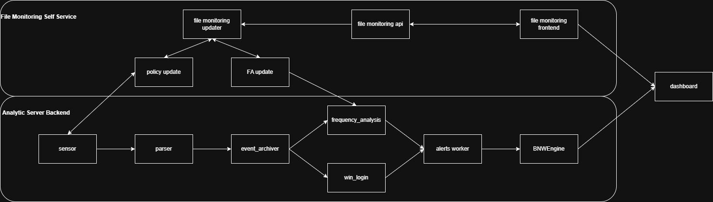

- [File Monitoring System](#file-monitoring-system)
  - [Overview](#overview)
  - [Architecture](#architecture)
  - [Component Details](#component-details)
    - [Server Component (update\_file\_audit\_to\_server.rb)](#server-component-update_file_audit_to_serverrb)
    - [Agent Communication Component (update\_file\_audit\_to\_sensor.rb)](#agent-communication-component-update_file_audit_to_sensorrb)
    - [Orchestration Component (settings\_file\_monitoring.rb)](#orchestration-component-settings_file_monitoringrb)
    - [Agent Component (heartbeat.cpp and audit\_file\_system.ps1)](#agent-component-heartbeatcpp-and-audit_file_systemps1)
      - [Heartbeat Process (heartbeat.cpp)](#heartbeat-process-heartbeatcpp)
      - [File System Auditing Script (audit\_file\_system.ps1)](#file-system-auditing-script-audit_file_systemps1)
        - [Requirements](#requirements)
        - [Key features](#key-features)
  - [Web Interface](#web-interface)
    - [Features](#features)
    - [Interface Sections](#interface-sections)
  - [API Endpoints](#api-endpoints)
    - [`get_file_audit`](#get_file_audit)
    - [`get_all_agents`](#get_all_agents)
    - [`add_file_audit`](#add_file_audit)
    - [`remove_file_audit`](#remove_file_audit)
    - [Agent Status Codes](#agent-status-codes)
  - [Audit Types](#audit-types)
    - [Write Operations (`report_write`)](#write-operations-report_write)
    - [Delete Operations (`report_delete`)](#delete-operations-report_delete)
    - [Standard Read Operations (`report_standard_read`)](#standard-read-operations-report_standard_read)
    - [Frequency Analysis Read (`threshold` != -1)](#frequency-analysis-read-threshold---1)
    - [Detection Modes: Frequency Analysis vs Normal Detection](#detection-modes-frequency-analysis-vs-normal-detection)
    - [Audit Type Combinations](#audit-type-combinations)
  - [Data Flow](#data-flow)
  - [Deployment and Configuration](#deployment-and-configuration)
  - [Testing](#testing)
    - [Unit Tests (Ruby)](#unit-tests-ruby)
    - [Integration Tests (Python)](#integration-tests-python)
  - [Error Handling](#error-handling)
  - [Security Considerations](#security-considerations)
  - [Performance Considerations](#performance-considerations)
    - [System-Level Optimizations](#system-level-optimizations)
    - [Web Interface Performance](#web-interface-performance)
    - [Agent-Side Efficiency](#agent-side-efficiency)
    - [Scalability Features](#scalability-features)
    - [Monitoring and Metrics](#monitoring-and-metrics)
    - [Optimization Recommendations](#optimization-recommendations)

# File Monitoring System

## Overview

The Settings File Monitoring system provides a comprehensive mechanism for monitoring files on agent systems for unauthorized access or modifications. It supports multiple audit types including write operations, delete operations, standard read operations, and frequency analysis. The system integrates with both server and agent components, allowing administrators to specify which files should be monitored, what types of operations to audit, and with what sensitivity threshold for frequency analysis.

## Architecture



The system consists of four main components:

1. **Server Component** (`update_file_audit_to_server.rb`): Manages the whitelist of files to be monitored through a Python configuration file.
2. **Agent Communication Component** (`update_file_audit_to_sensor.rb`): Transmits monitoring commands to agents via RabbitMQ.
3. **Orchestration Component** (`settings_file_monitoring.rb`): Coordinates between the server and agent components to ensure monitoring is properly synchronized.
4. **Agent Component** (`heartbeat.cpp` and `audit_file_system.ps1`): Receives commands from the server and applies file auditing configurations on the local system.
5. **Web Interface Component** (`FileMonitoring.vue`): Provides a user-friendly interface for managing file audit configurations with real-time status updates.

## Component Details

### Server Component (update_file_audit_to_server.rb)

This component is responsible for managing the whitelist of files to be monitored. It interfaces with a Python configuration file (`os.py`) that contains the rules for file monitoring.

**Key Features:**

- Add files to the monitoring whitelist with specified thresholds
- Remove files from the monitoring whitelist
- List all whitelisted files
- Associate files with specific agents for granular monitoring

**Usage:**

```bash
ruby update_file_audit_to_server.rb <command> [options]
```

**Commands:**

- `add <file_path> <threshold> [agent_id]` - Add a file to the whitelist with a specified threshold
- `remove <file_path> [agent_id]` - Remove a file from the whitelist
- `list [agent_id]` - List all whitelisted files, optionally filtered by agent ID

### Agent Communication Component (update_file_audit_to_sensor.rb)

This component handles communication with agents via RabbitMQ, sending commands to add or remove files from monitoring on the agents.

**Key Features:**

- Sends monitoring commands to specific agents
- Handles command responses from agents
- Validates agent connectivity and existence

**Usage:**

```bash
ruby update_file_audit_to_sensor.rb <command> <agent_id> [file_path]
```

**Commands:**

- `add <agent_id> <file_path>` - Add a file to monitoring on an agent
- `remove <agent_id> <file_path>` - Remove a file from monitoring on an agent
- `list <agent_id>` - List monitored files on an agent (stub implementation)

### Orchestration Component (settings_file_monitoring.rb)

This component runs as a scheduled process that synchronizes the server's whitelist with agent monitoring. It uses a state machine approach to track the status of each file monitoring request.

**State Machine:**

Add workflow semantics (per current implementation in `algos/settings_file_monitoring/settings_file_monitoring.rb`):

- `1` = Pending add (not yet attempted)
- `2` = Add succeeded (sensor returned `ok` and server update performed)
- `3` = Add failed (sensor did not reply `ok`, agent inactive, or other error) — eligible for retry

Remove workflow semantics:

- `-1` = Pending remove (not yet attempted)
- `-2` = Remove succeeded (sensor returned `ok` and server update performed)
- `-3` = Remove failed (sensor did not reply `ok`, agent inactive, or other error) — eligible for retry

Notes:

- Earlier documentation listed `3` / `-3` as "agent confirmed"; this has been corrected to reflect failure states.
- Inactive or missing agents are treated as failures (transition to `3` / `-3`) and skipped for sensor calls.
- Empty `agent_ids` maps are logged and skipped entirely.
- Success states (`2`, `-2`) and failure states (`3`, `-3`) are not reprocessed during the same cycle; retry logic for failures occurs in subsequent scheduler runs.
- Unrecognized or neutral values (e.g. `{}`) mean no operation requested.

The orchestration component checks every minute for files requiring synchronization and updates statuses based on sensor replies and server actions.

### Agent Component (heartbeat.cpp and audit_file_system.ps1)

The agent component is responsible for implementing file auditing on the monitored systems. The minimum required version is 2.4.1.8. It consists of two main parts:

#### Heartbeat Process (heartbeat.cpp)

The heartbeat process maintains constant communication with the analytics server and processes various commands, including file auditing commands. When the agent receives file auditing commands (rx == 7 for adding files or rx == 8 for removing files), it:

1. Reads the length of the incoming data and allocates memory for the file paths.
2. Reads the file paths string followed by an end marker (0xDEADBEEF).
3. Verifies the marker and processes the content.
4. Parses the received string of file paths that are separated by the "|" character.
5. Constructs a PowerShell command that invokes the `audit_file_system.ps1` script with appropriate parameters:
   - For adding files (rx == 7), it passes the file paths directly.
   - For removing files (rx == 8), it passes the `-ClearAuditing` flag along with the file paths.
6. Executes the PowerShell command using `CreateProcess()`.
7. Optionally waits for the script to complete execution (with a timeout).
8. Responds to the server with "ok" if successful, or "no" if there was an issue.

#### File System Auditing Script (audit_file_system.ps1)

This PowerShell script configures Windows System Access Control Lists (SACL) auditing for the specified files and directories.

##### Requirements

- NTFS file system (as SACLs are not supported on FAT32 or exFAT)
- Windows PowerShell 2.0 or higher
- Supported Windows versions:
  - Windows 7 or higher
  - Windows Server 2008 R2 or higher
  - Manual installation of powershell 2.0 is avaible for these older versions (.Net Framework 2.0 or higher is required):
    - Windows XP SP3
    - Windows Vista SP1
    - Windows Server 2003 SP2
    - Windows Server 2008

##### Key features

1. **Action Modes**:
   - **Add Mode**: Enables auditing for the specified files/folders.
   - **Remove Mode** (`-ClearAuditing` flag): Removes all auditing rules from the specified files/folders.

2. **Auditing Implementation**:
   - For files, it applies a single full control audit rule.
   - For directories, it applies audit rules with inheritance flags to ensure subfolders and files also inherit the monitoring settings.

3. **Audit Rules Configuration**:
   - Sets up auditing for all operations (FullControl)
   - Configures both success and failure auditing
   - Uses the WorldSid (Everyone) so that all users' actions are monitored
   - For directories, configures container inheritance and object inheritance

4. **Execution Flow**:
   1. Processes each provided path and determines if it's a file or directory
   2. Based on the path type and action mode:
      - Either applies comprehensive audit rules to the path
      - Or clears all audit rules from the path
   3. Applies the modified ACL to the file/directory
   4. Reports success or failure for each operation

This combination allows the centralized analytics server to remotely configure file auditing on agent systems, enabling monitoring of critical files for unauthorized access or modifications.

## Web Interface

The Settings File Monitoring system includes a modern Vue.js web interface (`FileMonitoring.vue`) that provides comprehensive file audit management capabilities:

### Features

1. **File Audit Configuration**:
   - Add new files to monitoring with customizable audit types
   - Select specific file operations to monitor (write, delete, read, frequency analysis)
   - Configure frequency analysis thresholds (disabled when frequency analysis is not selected)
   - Multi-agent selection for distributed monitoring

2. **Real-time Status Monitoring**:
   - Live agent status display with color-coded indicators:
     - **Enabled** (Green): Agent successfully monitoring the file
     - **Enabling** (Orange): Agent in process of setting up monitoring
     - **Disabled** (Red): Agent not monitoring the file
     - **Disabling** (Dark Red): Agent in process of removing monitoring
     - **Failed States** (Purple): Retry required for enable/disable operations
   - Auto-refresh every minute to show current status
   - Last updated timestamp display

3. **Audit Type Management**:
   - **Write Operations**: Monitor file write/modification attempts
   - **Delete Operations**: Monitor file deletion attempts
   - **Standard Read Operations**: Monitor standard file read access
   - **Frequency Analysis Read**: Monitor read frequency with configurable threshold

4. **Agent Management**:
   - Dynamic agent discovery and selection
   - Multi-agent deployment support
   - **Agent Visibility**: Only active agents are displayed in the frontend interface
     - Agents are considered **down** after 70 seconds of inactivity (shown as down in Sensor page)
     - Agents are considered **inactive** after 1870 seconds of inactivity (excluded from Settings page)
     - The Settings File Monitoring interface only shows agents that are not marked as inactive
   - Agent health status monitoring

5. **User Experience**:
   - Form validation ensuring required fields and audit types are selected
   - Success/error message notifications with auto-dismiss
   - Responsive design with organized grid layouts
   - Loading states for better user feedback

### Interface Sections

- **Add New File Audit Form**: Intuitive form for configuring new file monitors
- **File Audits Table**: Comprehensive view of all monitored files with:
  - File path display
  - Active audit types shown as colored badges
  - Threshold values (N/A when frequency analysis disabled)
  - Per-agent status monitoring
  - Quick removal actions

## API Endpoints

The system exposes several API endpoints through the `api.rb` file:

### `get_file_audit`

Retrieves a comprehensive list of all monitored files with their configurations.

**Response Structure:**

```json
{
  "status": "success",
  "path": ["C:\\path\\to\\file1.txt", "C:\\path\\to\\file2.txt"],
  "threshold": [10, -1],
  "report_write": [true, false],
  "report_delete": [false, true],
  "report_standard_read": [true, true],
  "agents_list": [{ "agent1": 2, "agent2": 1 }, { "agent3": -2 }]
}
```

### `get_all_agents`

Retrieves a list of all available active agents. This endpoint automatically filters out inactive agents to ensure only operational agents are available for file monitoring configuration.

**Agent Status Filtering:**

- Excludes agents marked as inactive (after 1870 seconds of inactivity)
- Includes agents that may be temporarily down (70+ seconds) but not yet inactive
- Only returns agents with `src_type` of 'sensor' or 'Sensor'

**Response Structure:**

```json
{
  "status": "success",
  "agents": ["agent1", "agent2", "agent3"]
}
```

### `add_file_audit`

Adds a new file to monitoring with specified audit types and agent assignments.

**Parameters:**

- `path`: File path to monitor
- `agents`: Array of agent names
- `threshold`: Frequency analysis threshold (set to -1 if frequency analysis disabled)
- `report_standard_read`: Boolean for standard read monitoring
- `report_write`: Boolean for write operation monitoring
- `report_delete`: Boolean for delete operation monitoring

**Response Structure:**

```json
{
  "status": "success"
}
```

### `remove_file_audit`

Removes a file from monitoring on specified agents.

**Parameters:**

- `path`: File path to remove from monitoring
- `agents`: Array of agent names to remove monitoring from

**Response Structure:**

```json
{
  "status": "success"
}
```

### Agent Status Codes

The API uses a state machine approach to track monitoring status:

| Code | Meaning (Add)                               | Meaning (Remove)                               | Retry? | Origin              |
| ---- | ------------------------------------------- | ---------------------------------------------- | ------ | ------------------- |
| 1    | Pending add request                         | N/A                                            | Yes    | User/API initiation |
| 2    | Add succeeded (sensor ok + server updated)  | N/A                                            | No     | Orchestration loop  |
| 3    | Add failed (sensor not ok / inactive agent) | N/A                                            | Yes    | Orchestration loop  |
| -1   | N/A                                         | Pending remove request                         | Yes    | User/API initiation |
| -2   | N/A                                         | Remove succeeded (sensor ok + server updated)  | No     | Orchestration loop  |
| -3   | N/A                                         | Remove failed (sensor not ok / inactive agent) | Yes    | Orchestration loop  |

Clarifications:

- Values `3` and `-3` are failure states (not confirmations) and are retried on subsequent cycles.
- Inactive agents (missing or flagged) produce failure transitions without attempting sensor calls.
- Neutral values (e.g. `{}`) indicate no active monitoring request; these are ignored.

## Audit Types

The system supports four distinct types of file auditing that can be enabled independently or in combination:

### Write Operations (`report_write`)

Monitors file write and modification operations, including:

- File content modifications
- File attribute changes
- File metadata updates
- New file creation in monitored directories

**Use Cases:**

- Detecting unauthorized file modifications
- Monitoring configuration file changes
- Tracking document tampering
- Compliance auditing for data integrity

### Delete Operations (`report_delete`)

Monitors file and directory deletion attempts, including:

- File deletion
- Directory removal
- Move operations that effectively delete from original location
- Recycle bin operations

**Use Cases:**

- Preventing accidental data loss
- Detecting malicious file destruction
- Compliance requirements for data retention
- Forensic investigation support

### Standard Read Operations (`report_standard_read`)

Monitors standard file read access, including:

- File opening for read access
- Directory browsing
- File content reading
- Metadata access

**Use Cases:**

- Detecting unauthorized access to sensitive files
- Compliance auditing for data access
- User behavior monitoring
- Security incident investigation

### Frequency Analysis Read (`threshold` != -1)

Advanced monitoring that tracks read frequency patterns with configurable thresholds:

- Counts read operations over time periods
- Triggers alerts when threshold exceeded
- Analyzes access patterns for anomalies
- Supports customizable sensitivity levels

**Configuration:**

- **Threshold**: Number of read operations that trigger analysis (when set to -1, frequency analysis is disabled)
- **Time Window**: Analysis period for frequency counting
- **Pattern Detection**: Identifies unusual access patterns

**Use Cases:**

- Detecting automated data exfiltration
- Identifying compromised accounts with abnormal access patterns
- Monitoring for bulk data access attempts
- Advanced threat detection and response

### Detection Modes: Frequency Analysis vs Normal Detection

File read operations support two distinct detection modes. File write and file deletion always use **normal detection**.

**Frequency Analysis (read operations with `threshold` != -1):**

Both of the following conditions must be satisfied to trigger an alert:

1. `value > threshold`
2. `value > (mean of past 30 days events + 3 * standard deviation)`

Key behaviours:

- Days without data are ignored when computing the mean and standard deviation. For example, if only 29 days have data then the calculation uses the average of those 29 days plus 3 times their standard deviation.
- If data exists on only one day (e.g. Sunday), the second condition will not be satisfied because there is insufficient historical variance.
- It does not matter when the file reads occur during the week. As long as both conditions above are met, the alert is triggered on the upcoming **Sunday at 23:45**.

**Normal Detection (standard read, write, and delete operations):**

- The alert is sent **once**, the first time a user reads/writes/deletes the monitored file.
- The per-user read count is **reset daily**, so it is possible for the same alert to trigger once per day if the user accesses the file again after the reset.

### Audit Type Combinations

The system allows flexible combinations of audit types:

- **Full Monitoring**: All four types enabled for comprehensive coverage
- **Write-Only**: Focus on data integrity and unauthorized modifications
- **Access Monitoring**: Standard read + frequency analysis for access pattern detection
- **Change Detection**: Write + delete operations for change tracking
- **Custom Combinations**: Any combination based on specific security requirements

## Data Flow

1. **Administrator Configuration**: Administrator configures file monitoring via the web interface:
   - Specifies file path to monitor
   - Selects desired audit types (write, delete, standard read, frequency analysis)
   - Sets frequency analysis threshold (if enabled, otherwise set to -1)
   - Chooses target agents for monitoring

2. **API Processing**: The `add_file_audit` API endpoint processes the request:
   - Validates input parameters and agent availability
   - Stores configuration in MongoDB with initial status `1` for each selected agent
   - Creates audit type flags (`report_write`, `report_delete`, `report_standard_read`)

3. **Orchestration Cycle**: The orchestration component (`settings_file_monitoring.rb`) runs every minute:
   - Scans for files with agent status `1` (pending addition) or `-1` (pending removal)
   - Filters out inactive agents to avoid unnecessary processing
   - Processes each agent-file combination individually

4. **Agent Communication**: For each file requiring agent updates:
   - **Addition Process** (status `1`):
     - Sends file path to agent via RabbitMQ (command code 7)
     - Agent heartbeat process receives and parses the file paths
     - Invokes `audit_file_system.ps1` to configure Windows auditing
     - Agent responds with "ok" or "no" based on success
     - Updates agent status to `2` (success) or `3` (retry required)

   - **Removal Process** (status `-1`):
     - Sends file path with removal flag to agent (command code 8)
     - Agent invokes `audit_file_system.ps1` with `-ClearAuditing` flag
     - Updates agent status to `-2` (success) or `-3` (retry required)

5. **Server-Side Updates**: After successful agent confirmation:
   - Updates frequency analysis whitelist in `os.py` configuration file
   - Adds/removes file monitoring rules on the analytics server
   - Synchronizes audit type settings across system components

6. **Status Monitoring**: The web interface continuously monitors status:
   - Auto-refreshes every minute to show current agent states
   - Displays color-coded status indicators for each agent-file combination
   - Shows which audit types are active for each monitored file
   - Provides real-time feedback on configuration changes

7. **Error Handling and Retries**: Failed operations are automatically retried:
   - Status `3` (failed enable) and `-3` (failed disable) trigger retry attempts
   - Inactive agents are skipped to prevent unnecessary retry loops
   - Error details are logged for troubleshooting and monitoring

## Deployment and Configuration

The system requires:

1. RabbitMQ for agent communication
2. MongoDB for status tracking and configuration storage
3. Access to the frequency analysis configuration file (`os.py`)

## Testing

The system includes both unit and integration tests to validate orchestration logic and end-to-end alert behavior.

### Unit Tests (Ruby)

File: `tests/fast/algos/settings_file_monitoring/test_ut_settings_file_monitoring.rb`

Focus:

- Add success (`1 -> 2`) and add failure (`1 -> 3`)
- Remove success (`-1 -> -2`) and remove failure (`-1 -> -3`)
- Skipping inactive agents (no sensor call, failure state applied)
- Missing agent documents treated as inactive
- Multi-agent updates: mixed success/failure transitions in a single run
- Ignoring states already in terminal status (`2`, `-2`, `3`, `-3`)
- Handling empty `agent_ids` maps (logged and skipped)
- Multiple `file_audit` entries iteration correctness

Methodology:

- Mongo collections, logger, sensor, and server objects are fully mocked.
- Assertions verify sensor/server call sequences and final agent status map updates.

### Integration Tests (Python)

File: `tests/fast/algos/settings_file_monitoring/test_integration_file_monitoring.py`

Flow Validated:

1. Synthetic Windows Security Event 4663 generated and published via RabbitMQ.
2. `parser_win_security.py` consumes raw event, categorizes object access.
3. Structured event delivered to `win_login.py` which processes object access semantics.
4. Anomaly alert written to MongoDB with mapped alert IDs (e.g., 46634, 46636, 46638).

Scenarios:

- Read access success (mask `0x1`) -> alert 46634
- Write access success (mask `0x2`) -> alert 46636
- Delete access success (delete mask) -> alert 46638
- Append access and multi-mask combinations
- No alert when audit flags disabled (verifies gating by `report_*` flags)
- Detailed field validation (user, role, IP, timestamps)

Prerequisites:

- MongoDB running locally
- RabbitMQ broker available
- `win_login.py` and parser initialized (`onInit()` executed)

Execution:

- Run Ruby unit tests directly via `ruby tests/fast/algos/settings_file_monitoring/test_ut_settings_file_monitoring.rb`.
- Run Python integration tests via `pytest tests/fast/algos/settings_file_monitoring/test_integration_file_monitoring.py -v`.

Future / Planned Tests:

- Frequency analysis threshold behavior
- Automatic retry validation for persistent `3` / `-3` states
- Performance under large agent sets and high file counts
- Fault injection (simulated sensor communication failures)

## Error Handling

The system includes robust error handling mechanisms:

- Communication timeouts with agents
- File access errors for the whitelist file
- Agent validation
- Threshold validation

## Security Considerations

- Agent identifiers are validated before sending commands
- Thresholds are validated to ensure they are reasonable
- Path validation occurs before adding files to the whitelist
- File auditing is implemented using Windows Security Access Control Lists (SACLs)
- All audit rules are applied with "Everyone" principal to ensure comprehensive coverage
- Both success and failure auditing is enabled to capture all access attempts
- Directory auditing includes object inheritance to ensure new files are automatically audited

## Performance Considerations

### System-Level Optimizations

- **1-Minute Orchestration Cycle**: Balances responsiveness with system load, preventing excessive processing overhead
- **Inactive Agent Filtering**: Automatically excludes inactive agents from processing to reduce unnecessary operations
  - Agents inactive for 1870+ seconds are excluded from all processing and frontend display
  - Agents down for 70+ seconds (but not inactive) may still appear in settings but are handled gracefully
  - This dual-threshold approach balances availability with resource efficiency
- **Batch Agent Communication**: Multiple file paths sent as pipe-delimited strings in single RabbitMQ messages
- **Optimized Database Queries**: Efficient MongoDB queries with proper indexing on agent IDs and file paths
- **Status-Based Processing**: Only processes files requiring state changes (status 1, -1, 3, -3)

### Web Interface Performance

- **Auto-Refresh Strategy**: 1-minute intervals provide real-time updates without overwhelming the server
- **Selective Data Loading**: Separate loading states for agents and file audits to improve perceived performance
- **Client-Side Validation**: Form validation prevents unnecessary API calls for invalid configurations
- **Efficient Status Display**: Color-coded badges and optimized rendering for large agent lists
- **Async Operations**: Non-blocking API calls with proper loading states and error handling

### Agent-Side Efficiency

- **Single PowerShell Execution**: Multiple files processed in one script invocation to reduce process overhead
- **SACL Optimization**: Windows audit rules applied efficiently using native PowerShell cmdlets
- **Confirmation-Based Updates**: Agent status only updated after successful audit configuration
- **Timeout Management**: Reasonable timeouts prevent hanging operations from blocking the system

### Scalability Features

- **Multi-Agent Support**: Horizontal scaling through distributed agent deployment
- **Granular Audit Types**: Selective monitoring reduces audit log volume and processing overhead
- **Threshold-Based Analysis**: Frequency analysis only enabled when needed to minimize performance impact
- **Retry Logic**: Failed operations automatically retried without manual intervention

### Monitoring and Metrics

- **Real-Time Status Tracking**: Live monitoring of agent states and configuration progress
- **Error Rate Monitoring**: Failed operations tracked and logged for performance analysis
- **Response Time Tracking**: API response times monitored for performance optimization
- **Resource Usage**: Database and message queue utilization monitored for capacity planning

### Optimization Recommendations

- **Database Indexing**: Ensure proper indexes on frequently queried fields (agent IDs, file paths, status)
- **Message Queue Tuning**: Configure RabbitMQ for optimal throughput based on agent count
- **Log Level Management**: Use appropriate log levels to balance debugging capability with performance
- **Periodic Cleanup**: Regular cleanup of completed audit records to maintain database performance
